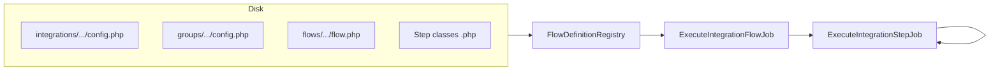

# Developer guide — integration flows

This document explains how **disk-based integrations** are structured, how they run on the queue, and how to add or change them. It is aimed at developers maintaining or extending this application.

## High-level architecture

- **Integration definitions live on disk** under `integrations/` (or the path set by `FLOWS_INTEGRATIONS_PATH` / `config/flows.php` → `integrations_path`).
- The **`FlowDefinitionRegistry`** scans folders, loads `config.php` files, and resolves a **flow** identified by a **`flow_ref`** string: `integration-slug/group-slug/flow-slug`.
- A **flow** is a **linear chain of steps** (PHP classes implementing `Step`). Each step returns a `StepResult` with updated **context** (output array) and optionally the **next step class name**.
- **Execution** is asynchronous: `ExecuteIntegrationFlowJob` starts a run; **`ExecuteIntegrationStepJob`** runs each step and dispatches the next one (or handles **fan-out** child runs).
- **Connectors** (credentials + vendor clients) are **database-backed** (`connectors` table, Filament admin). Steps resolve them through **`ConnectorsHelper`** inside `DiskFlowContext`.



## Directory layout

Each integration is a directory: `integrations/{integration-slug}/`.

Expected layout:

```text
integrations/{integration-slug}/
  config.php                          # Integration-level config
  groups/{group-slug}/
    config.php                        # Group-level config
    flows/{flow-slug}/
      flow.php                        # Entry step class(es)
      YourStepClass.php               # Step implementations (and more classes as needed)
```

Slugs are **kebab-case** (e.g. `dummy-json-netsuite`, `orders-to-netsuite`, `sync-orders`).

## `flow_ref`

A flow is addressed as:

```text
{integration-slug}/{group-slug}/{flow-slug}
```

Example: `dummy-json-netsuite/orders-to-netsuite/sync-orders`.

This value is stored on **`FlowExecution.flow_ref`**, used in the admin UI, schedules, and CLI.

## Configuration files and merging

### Integration `config.php`

Must define at least:

- **`key`** (string): stable integration identifier (often matches or relates to the folder slug).
- **`name`** (string): human-readable name for the UI.

Optional / common:

- **`image_url`**: logo for dashboards.
- **`extra_config`**: arbitrary array merged into the flow’s effective config (see below).
- **`failure_notifications`**: optional `mail` (list of addresses), `slack_webhook_url`, `teams_workflow_webhook_url`. These merge with group and flow-level notification settings and global **Notification channel settings** in the admin.

### Group `groups/{group-slug}/config.php`

Typically holds group-level **`extra_config`** and optional **`failure_notifications`**.

### Flow `flows/{flow-slug}/flow.php`

Must define:

- **`entry`**: a list of one or more **fully qualified step class names**. The **first** class is the first step to run (unless an override is passed when dispatching the job). Declaring multiple classes in `entry` documents the ordered pipeline; transitions are driven by each step’s `StepResult::$nextStepClass`.

At runtime, **`DiskFlowDefinition::mergedConfig()`** deep-merges:

1. Integration `extra_config`
2. Group `extra_config`
3. Flow extra from metadata (if the first entry implements `DefinesFlowMetadata`)

Steps read the result via **`DiskFlowContext::mergedConfig()`**.

## Step implementation

### `Step` contract

```php
interface Step
{
    public function run(DiskFlowContext $context): StepResult;
}
```

### `StepResult`

- **`output`**: associative array merged into the flow execution **context** for the next step (and persisted on `FlowExecution`).
- **`nextStepClass`**: `class-string<Step>|null`. If `null`, the flow ends successfully after this step.

### `DiskFlowContext` (what you get in `run()`)

- **`execution`**: `FlowExecution` model (status, ids, timestamps, etc.).
- **`context()`**: current context snapshot (previous steps’ outputs merged).
- **`triggerPayload()`**: payload from manual run / schedule / API (immutable for the run).
- **`mergedConfig()`**: merged disk config (integration + group + flow extras).
- **`connectors`**: **`ConnectorsHelper`** — use to build vendor clients with stored credentials.
- **`logs`**: **`StepLogCollector`** — structured log lines attached to the step execution.

### Idempotency contract (disk steps)

Flow steps run under **`ExecuteIntegrationStepJob`** with **`$tries = 1`**. The queue worker does **not** automatically retry a failed step; failures mark the **`StepExecution`** and usually end the **`FlowExecution`**.

The runner still applies a **best-effort idempotent guard**: if a row for the same **`flow_execution_id`** + **`step_index`** already exists with status **`COMPLETED`** and the same **`step_class`**, the job exits without running **`run()`** again. That covers accidental **duplicate delivery** of the same job payload, not every business-level “run twice” scenario.

Authors of **`Step`** implementations should treat **`run()`** as **at-most-once effective side effects** in normal operation, but **safe if invoked again** when the guard fires or during rare operational replays:

- Prefer **vendor idempotency keys**, **upsert** APIs, or **“find then create”** patterns instead of blind creates.
- Enforce **unique constraints** in your own tables when a step writes durable ids linked to source records.
- Keep outputs **deterministic** for the same inputs so re-playing a step does not corrupt **`FlowExecution.context`** (keys are **`{stepIndex}_{ClassBasename}`**).
- Long external calls should still respect **`$timeout`** on the job and **`flows.longest_expected_step_seconds`**; a killed worker can leave a step **`RUNNING`** until **reconcile** or manual fix — design side effects so partial progress is recoverable.

### Progress heartbeats (long steps)

**`flows:reconcile-stale-running`** treats **`FlowExecution`** rows as stale when **`status`** is **`RUNNING`** and **`updated_at`** is older than **`--minutes`** (see **`config/flows.php`** → **`reconcile_stale_running_minutes`**). A single step that runs longer than that threshold without finishing will look like a dead run unless something bumps **`updated_at`**.

From inside **`Step::run()`**, call **`DiskFlowContext::heartbeat()`** occasionally during slow work (pagination, chunked exports, long vendor calls):

```php
foreach ($pages as $page) {
    $context->heartbeat(); // throttled by flows.heartbeat_interval_seconds (env FLOW_HEARTBEAT_INTERVAL_SECONDS)
    // ... do work ...
}
```

- Each successful heartbeat updates **`flow_executions.updated_at`** (only if the run is still **`RUNNING`**) and, when the current step row is known, **`step_executions.updated_at`** for the in-flight step.
- Default throttle is **60 seconds** between no-op writes (configurable). Pass **`$context->heartbeat(0)`** to skip throttling (tests or rare cases).
- Keep **`reconcile_stale_running_minutes`** **greater** than your slowest normal step **unless** heartbeats run often enough to keep **`updated_at`** fresh.

### Business rule failures (how to signal errors in steps)

**`StepResult`** is only for the **success** path: structured **`output`** and optional **`nextStepClass`**. There is no “failed result” object — a step that cannot continue must **fail by throwing**.

**What the platform does**

- **`DiskStepRunner`** calls **`Step::run()`**. Any uncaught **`Throwable`** is handled by **`ExecuteIntegrationStepJob`**: the **`StepExecution`** is marked **`failed`**, **`FlowExecution`** moves to **`failed`** (or fan-out aggregation runs for children), and **`IntegrationFailureNotifier`** may run using merged disk/admin notification config.
- The **exception message** is what operators see first: it is stored on **`StepExecution.error_message`** and **`FlowExecution.error_message`** (and feeds failure notifications). Keep it **short, precise, and in English** (same standard as other operator-facing copy in this project).

**Recommended patterns**

1. **Business / contract rules** (precondition not met, invalid payload, vendor says “rule blocked this order”, duplicate not allowed): throw **`RuntimeException`** (or a **small project-specific subclass** of **`RuntimeException`**) with a message that states **what failed** and, when useful, **which key or record** (without leaking secrets).

   ```php
   if ($order['status'] !== 'open') {
       throw new RuntimeException(
           'Order cannot be imported: status must be "open", got "'.($order['status'] ?? 'null').'".'
       );
   }
   ```

2. **Programming or configuration mistakes** (missing required **`mergedConfig()`** key, wrong type that indicates a broken flow definition): **`InvalidArgumentException`** is appropriate so logs read as “caller/configuration error” rather than “customer data error”. Use sparingly for things integrators are expected to fix in code or config.

3. **HTTP / vendor errors**: Do not throw raw low-level client exceptions without context. Prefer catching, then throwing **`RuntimeException`** (or rethrow as-is only if the message is already safe and clear). Map **4xx validation** responses into a **single line** that names the field or error code the operator can act on.

4. **Diagnostics**: Use **`$context->logs`** (**`info`**, **`warning`**, etc.) for **structured detail** (ids, counts, response snippets that are safe to store on the step). The **`Throwable`** message should remain the **headline**; logs carry the **supporting facts**.

**What not to do**

- Do **not** return a **`StepResult`** to mean “error” — the next step would still run and **`FlowExecution.context`** could be wrong.
- Do **not** rely on Laravel queue **retries** for business fixes; steps use **`$tries = 1`**. Correct the data or the rule, then **start a new run** (or add an explicit future “replay” feature if the product defines one).
- Do **not** put stack traces or secrets in the exception message; Filament and notifications are operator-facing.

Reference step examples: **`TransformOrderStep`** / **`CreateNetSuiteOrderStep`** in **`dummy-json-netsuite`** (`RuntimeException` for missing context or payload).

### First entry and `DefinesFlowMetadata`

The **first class** in `flow.php`’s `entry` array may implement **`DefinesFlowMetadata`** to provide:

- Display **name** and **active** flag for the flow in Filament.
- **`flowDefinitionExtraConfig()`** merged into the flow’s config.

If it does not implement the interface, the registry synthesizes a default name and treats the flow as active.

Reference: `App\Integrations\Contracts\DefinesFlowMetadata`, `App\Integrations\FlowDefinitionMetadata`.

## Class autoloading and namespaces (important)

Classes under `integrations/` are **not** Composer PSR-4 mapped by default. **`IntegrationsAutoload`** registers a class loader in `AppServiceProvider` that maps:

`Integrations\{IntegrationStudly}\Groups\{GroupStudly}\Flows\{FlowStudly}\{ClassName}`

to:

`integrations/{kebab-integration}/groups/{kebab-group}/flows/{kebab-flow}/{ClassName}.php`

Rules:

- Folder names are **kebab-case** matching **`Str::kebab()`** of each Studly segment.
- Namespace segments must match **`Str::studly()`** of each slug (hyphens in slugs are normalized for the integration part; see `IntegrationsAutoload`).

**Practical recommendation:** run **`php artisan integrations:make`** to scaffold a new integration so namespaces and paths stay consistent.

## Connectors

- **Storage:** `Connector` Eloquent model; credentials are encrypted (see Filament **Connectors** resource / policies).
- **Resolution:** `ConnectorsHelper::credentials($key)` tries **user-scoped** connector rows first, then a **global** row (`user_id` null).
- **Typed accessors:** add methods on `ConnectorsHelper` (e.g. `netsuite($key)`, `dummyJson($key)`) that return a small **connector class** constructed from `credentials()`.

To support a **new external system**:

1. Add a **`ConnectorType`** enum case and connector definition (fields, labels, validation) in `App\Connectors` / `App\Enums` as per existing vendors.
2. Implement a connector class that performs HTTP/API calls using the credential array.
3. Expose a method on **`ConnectorsHelper`** and use it from steps.

## Fan-out (parallel item processing)

A step may **spawn one child `FlowExecution` per item** so downstream steps run in isolation (separate queue jobs).

- Mark the step class with the **`#[FanOut(...)]`** attribute (`App\Integrations\Attributes\FanOut`).
- The step’s **output** must include the **list path** (e.g. `items`) configured on the attribute.
- **`FanOutCoordinator`** creates child executions, tracks completion on the parent context under **`_fan_out`**, and drives failure handling / notifications when appropriate.

Read `App\Integrations\FanOut\FanOutCoordinator` and the sample `FetchDummyOrdersStep` in `dummy-json-netsuite`.

## Execution lifecycle (queues)

- **`config/flows.php`**: `max_steps` (safety cap), **`queue`** name (default `flows`), **`longest_expected_step_seconds`** (default **300** — use for heavy NetSuite steps). That value drives default **`retry_after`** on database/Redis queues (lease time, **not** step retries; flow jobs use **`$tries = 1`**) and **`ExecuteIntegrationStepJob::$timeout`** for Horizon. Override with **`FLOW_LONGEST_STEP_SECONDS`** or explicit **`REDIS_QUEUE_RETRY_AFTER`** / **`DB_QUEUE_RETRY_AFTER`** when needed.
- **`ExecuteIntegrationFlowJob`**: resolves definition, creates/updates **`FlowExecution`**, marks running, dispatches first **`ExecuteIntegrationStepJob`** (or handles inactive flow).
- **`ExecuteIntegrationStepJob`**: loads context, runs **`DiskStepRunner`**, records **`StepExecution`**, dispatches next step or completes / fails the flow.
- In **production**, run workers via **Laravel Horizon** on **Redis** (`QUEUE_CONNECTION=redis`, `php artisan horizon`). Without Horizon, you can use `php artisan queue:work redis --queue=flows,default,notifications,internal`.

Failure notifications go through **`IntegrationFailureNotifier`** (respects merged failure notification config and optional per-flow channel toggles in the database).

## Laravel Horizon

**Horizon** supervises Redis queue workers and provides a dashboard at **`/horizon`** (same session as the app; **admin** role required outside `local`; in `local`, access is open by default — tighten in **`App\Providers\HorizonServiceProvider`** if needed).

### Production expectations (~50 integrations, ~5‑minute schedules, NetSuite)

- Set **`QUEUE_CONNECTION=redis`**, ensure **Redis** is running, and run **`php artisan horizon`** (use **Supervisor** or **systemd** in real deployments, not an SSH session).
- **`config/horizon.php`** defines two supervisors:
  - **`supervisor-flows`**: queue **`flows`** (from **`FLOWS_QUEUE`**). Defaults: **`minProcesses` 2 / `maxProcesses` 12** in `production`, **`timeout` 600** s, **`memory` 256** MB, **`tries` 1**. Lower **`HORIZON_FLOWS_MAX_PROCESSES`** if NetSuite governance or concurrency limits require fewer parallel imports.
  - **`supervisor-general`**: **`default`**, **`notifications`**, **`internal`** with shorter timeouts.
- **`horizon:snapshot`** is scheduled **every five minutes** in **`routes/console.php`** (with **`schedule:run`**).
- **PHP extensions:** Horizon needs **`ext-pcntl`** and **`ext-posix`** (Linux, WSL, Docker). They are **not** available on Windows PHP — use WSL/Docker for `horizon` locally or run `queue:listen` on Windows only for light dev.

### Useful env vars

See **`.env.example`** (`HORIZON_*`, **`REDIS_*`**). Align **`HORIZON_FLOWS_TIMEOUT`** with **`FLOW_LONGEST_STEP_SECONDS`** and Redis **`retry_after`** (see **`ARCHITECTURE_REVIEW.md`**).

### Advanced observability (tags and log context)

- **Horizon tags** — Filter and inspect jobs in the Horizon UI using stable tags:
  - **`ExecuteIntegrationFlowJob`**: `integration:ExecuteIntegrationFlowJob`, `flow_ref:{flow_ref}`, `trigger:{triggered_by_type}`, and `flow_execution:{id}` when known at dispatch.
  - **`ExecuteIntegrationStepJob`**: `integration:ExecuteIntegrationStepJob`, `flow_execution:{id}`, `step:{index}`, `step_class:{basename}`, optional `flow_ref:{flow_ref}`, and `fan_out:child` for fan-out children.
- **Structured logging** — Both jobs use job middleware **`BindIntegrationFlowLogContext`** so Laravel’s **`Context`** adds **`flow_ref`**, **`flow_execution_id`**, **`integration_job`**, and step fields (**`step_index`**, **`step_class`**, **`fan_out_child`**) to log records emitted while the job runs (in addition to any HTTP **`Context`** captured when the job was queued).

### Long-wait notifications

Horizon can email, Slack, or SMS when a queue wait exceeds the **`waits`** thresholds in **`config/horizon.php`**. Optional env vars (see **`.env.example`**): **`HORIZON_NOTIFICATIONS_MAIL`**, **`HORIZON_NOTIFICATIONS_SLACK_WEBHOOK`**, **`HORIZON_NOTIFICATIONS_SLACK_CHANNEL`**, **`HORIZON_NOTIFICATIONS_SMS`**. Leave them empty to disable a channel. Configure Slack/SMS mailers per Laravel’s notification channel docs before enabling.

## Admin UI (Filament)

- Integrations and flows are listed from the **registry** (disk), not from DB rows (except schedules and execution history).
- **Flow schedules**, **run now**, and **notification channel** actions are available on integration flow pages.
- **Flow executions** and **step executions** are inspectable via their resources.

## Artisan commands (reference)

All commands below are defined under `app/Console/Commands/`. Run **`php artisan list`** (or **`php artisan help <command>`**) for the built-in Laravel help output.

### Flows — run and validate

#### `flows:validate`

- **Purpose:** Loads every `flow_ref` discovered by **`FlowDefinitionRegistry`** and calls **`resolve()`** on each one. Catches missing files, invalid `flow.php`, bad step class names, and similar issues.
- **Exit code:** `0` if all flows pass; **non-zero** if any flow fails (messages are printed per `flow_ref`).
- **When to use:** After scaffolding or editing integrations; in CI before deploy.
- **Example:** `php artisan flows:validate`

#### `flows:run`

- **Purpose:** Starts a flow execution either **asynchronously** (default: dispatches to the **`flows`** queue) or **synchronously** in the current process (`--sync`).
- **Argument:** `flow_ref` — three-part ref, e.g. `dummy-json-netsuite/orders-to-netsuite/sync-orders` (leading/trailing slashes are trimmed).

| Option | Description |
|--------|-------------|
| `--user=` | Existing user ID. Sets `triggered_by_user_id` and scopes **connector** resolution to that user first (then global fallback). |
| `--trigger=manual` | Label stored with the run (e.g. `manual`, `api`, `webhook`, `schedule`). Default: `manual`. |
| `--payload=` | JSON **object** merged into `trigger_payload` for the execution (must be valid JSON). |
| `--step=` | Optional fully qualified class name of the **first** step; overrides the first entry in `flow.php` (e.g. webhook entry points). |
| `--sync` | Temporarily forces the **`sync`** queue connection so the entire flow runs in this console process (useful for local debugging without a worker). |

- **Examples:**
  - `php artisan flows:run dummy-json-netsuite/orders-to-netsuite/sync-orders`
  - `php artisan flows:run my-int/my-group/my-flow --sync`
  - `php artisan flows:run my-int/my-group/my-flow --payload='{"order_id":123}' --trigger=api`

#### `flows:schedule-runner`

- **Purpose:** Finds **active** `FlowSchedule` rows whose **`next_run_at`** is due, dispatches **`ExecuteIntegrationFlowJob`** for each (with `trigger` set to schedule), and advances **`next_run_at`**. In this app it is registered in **`routes/console.php`** to run **every minute** with **`withoutOverlapping()`**; ensure **`php artisan schedule:run`** is invoked by cron (or the Laravel scheduler) in each environment.
- **Option:** `--limit=50` — maximum number of due schedules to process in one invocation (minimum effective value: 1).

- **Example:** `php artisan flows:schedule-runner --limit=100`

#### `flows:reconcile-stale-running`

- **Purpose:** Finds **`FlowExecution`** rows still **`RUNNING`** whose **`updated_at`** is older than a threshold (default **120 minutes**) and marks them **`FAILED`** with a clear error message. Intended for **orphaned runs** (worker crash, unrecoverable queue errors) where no step is making progress.
- **Options:**
  - `--minutes=120` — stale threshold; must be **greater than your longest normal step** if a single step does not touch **`FlowExecution.updated_at`** until it completes.
  - `--dry-run` — print matching execution ids/refs without updating rows.
- **Fan-out children:** If a stale row is a **child** (`parent_flow_execution_id` set), the command marks it failed and calls **`FanOutCoordinator::recordChildTerminal`** so parent aggregation continues.
- **Notifications:** Root executions trigger **`IntegrationFailureNotifier`** after reconciliation; rely on parent fan-out state for child failures.
- **Example:** `php artisan flows:reconcile-stale-running --minutes=180`
- **Scheduler:** Registered in **`routes/console.php`** to run **hourly** when **`FLOW_RECONCILE_STALE_ENABLED`** is not false (default on). Threshold comes from **`FLOW_RECONCILE_STALE_MINUTES`** / **`config('flows.reconcile_stale_running_minutes')`** (default **180**). Requires **`php artisan schedule:run`** via cron on the server.

### Integrations — scaffolding

#### `integrations:make`

- **Purpose:** Interactive wizard: creates **`integrations/{slug}/`**, group and flow directories, **`config.php`** files, **`flow.php`**, and optionally the **first step class** implementing **`DefinesFlowMetadata`** + **`Step`**.
- **When to use:** Starting a new integration from scratch.
- **Afterwards:** Run **`flows:validate`** (the command may invoke it at the end).

#### `integrations:make-group`

- **Purpose:** Adds a **new group** (folder + `config.php`) under an **existing** integration slug. Prompts for group slug and related paths.
- **When to use:** You already have `integrations/{integration}/` and need another `groups/{group}/` tree.

#### `integrations:make-step`

- **Purpose:** Creates a new **step class file** under `integrations/{integration}/groups/{group}/flows/{flow}/` with the correct namespace pattern. Prompts for slugs and PascalCase class name.
- **When to use:** Adding a step without rerunning full `integrations:make`. You must still wire the class from another step’s **`StepResult`** and/or extend **`flow.php`** `entry` if it should appear in the documented chain.

### Connectors

#### `connectors:make`

- **Purpose:** Interactive creation of a **`connectors`** database row: key, display name, **`ConnectorType`**, optional user association, and **credential** fields per type. Complements the Filament “Connectors” UI.
- **When to use:** Quick seeding from CLI or automation-friendly setup in dev setups.

#### `connectors:run-method`

- **Purpose:** Pick a stored connector, choose a **public method** on the underlying connector class (e.g. NetSuite / DummyJSON), and **prompt for each parameter** (reflection-based). Useful for manual API smoke tests without writing a throwaway script.
- **Requirements:** At least one **`Connector`** row must exist.

### Quick checklist

- After any disk change to flows: **`php artisan flows:validate`**
- Local debug without a worker: **`php artisan flows:run {flow_ref} --sync`**
- Production/scheduling: ensure **`schedule:run`** is wired (cron) so **`flows:schedule-runner`** actually fires; see **`routes/console.php`**. Keep a worker on the **`flows`** queue.

## Adding a new integration (checklist)

1. Run **`integrations:make`** (or copy `dummy-json-netsuite` and rename carefully).
2. Implement **`Step::run()`** on each class; chain with **`StepResult(..., NextStep::class)`**.
3. Implement **`DefinesFlowMetadata`** on the **first** step if desired.
4. Wire **`flow.php`** `entry` to your first step class FQCN.
5. Add or reuse **connectors**; register credentials in admin for the keys your steps call.
6. Set **`failure_notifications`** in config if the integration should override defaults.
7. Run **`flows:validate`** and a **feature test** or manual **`flows:run`**.
8. Ensure **queue workers** run the `flows` queue in each environment.

## Reference integration

**`integrations/dummy-json-netsuite/`** is the canonical small example:

- **`flow.php`** — single entry, multi-step chain.
- **`FetchDummyOrdersStep`** — `DefinesFlowMetadata`, `FanOut`, `ConnectorsHelper::dummyJson()`, hands off to **`TransformOrderStep`** → **`CreateNetSuiteOrderStep`**.

Use it as a template for naming, structure, and queue behavior.

## Related application code (quick map)

| Area | Main entry points |
|------|-------------------|
| Discovery / resolve | `App\Integrations\FlowDefinitionRegistry` |
| Flow DTO | `App\Integrations\DiskFlowDefinition` |
| Step runner | `App\Integrations\DiskStepRunner` |
| Jobs | `App\Jobs\ExecuteIntegrationFlowJob`, `App\Jobs\ExecuteIntegrationStepJob` |
| Models | `App\Models\FlowExecution`, `App\Models\StepExecution`, `App\Models\FlowSchedule`, `App\Models\Connector` |
| Scaffolding | `MakeIntegrationCommand`, `MakeIntegrationGroupCommand`, `MakeIntegrationStepCommand` |
| Flows CLI | `FlowsValidateCommand`, `FlowsRunCommand`, `FlowsScheduleRunnerCommand`, `FlowsReconcileStaleRunningCommand` |
| Connectors CLI | `MakeConnectorCommand`, `RunConnectorMethodCommand` |

---

For **production queues, Horizon (Redis), and robustness** (transactions vs dispatch, retries, timeouts), see **`ARCHITECTURE_REVIEW.md`**.

For Laravel, Filament, and testing conventions used in this repo, see **`AGENTS.md`** and **`README.md`**.
